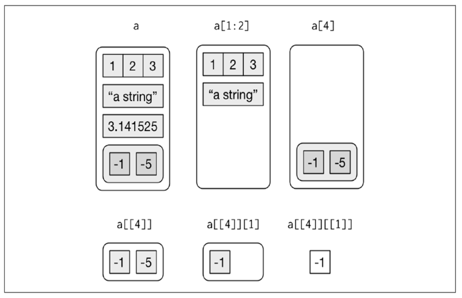

# **Tabla de contenidos**
<br>
1. [**Sintáxis R**](#id1)

  1.1 [*Expresiones*](#id1.1)

  1.2 [*Funciones*](#id1.2)

  1.3 [*Tipos de datos*](#id1.3)

2. [**Estructura de datos**](#id2)

  2.1 [*Vectores atómicos*](#id2.1)
    
  2.1.1 [*Operaciones vectorizadas*](#id2.1.1)
  
  2.2 [*Listas*](#id2.2)
  
  2.3 [*Matrices*](#id2.3)
  
  2.4 [*Data frames*](id2.4)
  
3. [**Filtrado y manipulación de datos**](#id3)

  2.1 [*Vectores*](#id2.1)

  2.2 [*Listas*](#id2.2)
  
  2.3 [*Matrices*](#id2.3)
  
  2.4 [*Data frames*](id2.4)
  
  
4. [**Más recursos**](#id4)

\newpage

# 1 Sintáxis R <a name="id1"></a>

Aprender un lenguaje de programación es como aprender un segundo idioma (sólo que más simple). Si visitamos un pais extranjero , podríamos aprender frases para salir del paso sin entender como está estructurado el lenguaje. De forma similar, si sólo queremos hacer un par de cosas con R (p. ej. dibujar gráficos), probablemente sea suficiente con estudiar a partir de unos cuantos ejemplos.

Sin embargo, si lo que queremos es aprender realmente bien un nuevo lenguaje, tendremos que aprender su sintaxis y gramática: conjugación verbos, estructuras gramaticales, etc. Lo mismo es cierto para R: si queremos aprender a programar en R, tendremos que aprender la sintaxis y gramática.

## 1.1 Expresiones <a name="id1.1"></a>

El código R está compuesto por una serie de expresiones. A continuación se muestran algunos ejemplos de cada una de estas expresiones.

 - Expresiones aritméticas.
 
```{r example 1}
2 + 1   # suma
2*6     # multiplicación
2/4     # división
3^3     # potencia
120%%5  # resto de una división
```

 - Expresiones de asignación.
 
Podemos crear nuevos "objetos" con el operador de asignación "<-" o también con "=". Todas las instrucciones de asignación dónde creamos objetos, tienen la misma forma:

nombre_objeto <- valor
 
```{r example 2}
Orwell <- 1984
Huxley = "A Happy World"

# recuperando el valor de los objetos:
Orwell
Huxley

```


- Expresiones lógicas 

Es posible construir condiciones lógicas utilizando los operadores &, | y ! (en lenguaje formal, yy, oo y nono respectivamente). La comparación de valores se lleva a cabo mediante == (es igual a) y != (es distinto de). La salida de estos comandos será un valor lógico TRUE o FALSE.

```{r example 3}
# Asignamos valores a objetos.
a <- 2
b <- 4
BCyM <- "grandioso"

# nos hacemos preguntas o hacemos construcciones.
BCyM == "aburrido" # BCyM es aburrido ?
a != b  # a es distinto de b ?
(a < 3) & (b < 5)  # ¿es a menor que 3 y b menor que 3?
(a < 1) | (b < 3)  # ¿es a menor que 1 o b menor que 3?
```


 - Expresiones de control: condicionales e iterativas 
 
La expresión condicional evalua la veracidad de la expresión lógica entre paréntesis "if (EXP. LÓGICA)" y luego ejecuta el código del cuerpo "if" si "EXP. LÓGICA = TRUE" o del cuerpo "else" si ""EXP. LÓGICA = FALSE"
 
```{r example 4}
# Expresión condicional
if (1 > 2) {"mayor"} else {"menor"}


```

La expresión iterativa "while" -itera- un bloque de código hasta que cierta expresión condicional se vuelve FALSE.
La expresión iterativa "for" -itera- un bloque de código hasta que el objeto "i" haya pasado por todos los valores de un vector.
 
```{r example 5}
# Expresión iterativa while.
i = 0
while (i<4){
  print(i)
  i = i+1
}

# Expresión iterativa for.
for (i in 1:4){
  print(i)
}

```


## 1.2 Funciones <a name="id1.2"></a>

En programación, usamos las funciones conocidas también como subrutinas, procedimientos, métodos etc., para contener un conjunto de instrucciones que queremos usar repetidamente o que, a causa de su complejidad, es mejor que esten independientes en un subprograma y llamarlas cuando sea necesario.

En R, de acuerdo con la documentación base, definimos una función con la siguiente construcción:
 nombre_función(lista_argumentos) {
  cuerpo_función
}

En el caso que necesitemos llevar a cabo una tarea en particular y deseemos crear nuestra propia función usaremos la siguiente plantilla:

nombre_función <- function(argumentos) {
  Cuerpo_función
}

Para poder "llamar" a la función una vez creada, simplemente escribimos el nombre de la función y elegimos el valor de los argumentos de la misma. El resultado de la función se puede guardar en un objeto.

Por ejemplo:

```{r example 6}

#  Definimos la función 
baskara <- function(a, b, c){
  x_1 <- (-b+sqrt(b^2 - 4*a*c))/2*a
  x_2 <- (-b-sqrt(b^2 - 4*a*c))/2*a
  return(c(x_1,x_2))
}

# ahora llamamos a la función asignandole valores a los parámetros a, b y c.
raíces <- baskara(-2,3,6)
raíces
```

## 1.3 Tipos de datos <a name="id1.3"></a>

### Logical:

El tipo logical es la forma que tiene R para los datos binarios. Usados en test lógicos son conocidos como valores boleanos y toman los valores TRUE y FALSE. TRUE y FALSE pueden ser abreviados con las T y F en mayúsculas respectivamente. 

Observar las salidas de los siguientes comandos:

```{r example 7}

3 < 4

class(TRUE)

class(T)

```

A continuación se proveen dos tablas con los operadores de comparación y lógicos en R:


### Numeric:

Para representar los números reales R proporciona el tipo numeric. Podemos realizar toda clase de operaciones con ellos como por ejemplo sumas, restas, multiplicaciones, divisiones y utilizarlos en el amplio catálogo de funciones matemáticas con las que cuenta R

```{r example 8}

mi_altura_en_cm <- 180
mi_peso <- 79.5
IMC <- mi_peso/mi_altura_en_cm^2
IMC

```


### Character:

Cualquier dato alfanumérico (o cadenas, strings en inglés; todo aquello que no sea un número es una cadena) será interpretado por R como character. Todos los strings siempre van entre comillas. Por ejemplo:

```{r example 9}

"No es de los valientes la batalla, ni de los entendidos las riquezas, ni de los hábiles el favor, sino que el tiempo y la suerte les llegan a todos"

```


### Otros Tipos de Datos Básicos

Por último, cabe señalar que existen otros tipos de datos básicos en R, como el double que es un tipo numérico de doble precisión. El complex para números complejos y el raw para almacenar bytes.Sin embargo, no los trataremos en este apunte puesto que raramente se utilizan en el análisis de datos.

Double (doble precisión)
Complex (números complejos)
Raw (almacenar bytes)
Integer (para número enteros)


# 2 Estructura de datos <a name="id2"></a>

Las colecciones o conjunto de datos en R se organizan por su dimensión (1º, 2º, o varias dimensiones) y si son homogéneas (todos los objetos deben ser del mismo tipo) o heterogéneas ( el contenido puede ser de diferentes tipos). A continuación se muestran los cinco tipos de datos más usados en el análisis de datos:


## 2.1 Vectores atómicos (o solo vectores) <a name="id2.1"></a>

Los vectores atómicos pueden ser creados con la función c(), que corresponde a la sigla de "combinar":

```{r example 10}

vector_1 <- c(1, 2.5, 4.5)
vector_1
vector_logical <- c(TRUE, FALSE, T, F)
vector_logical
vector_character <- c("Hola", "Mundo!")
vector_character

# una propiedad fundamental del vector es el largo:
length(vector_character)
```

Además, mediante el operador ":" podemos generar sucesiones de números de la siguiente manera "inicio:final"

```{r example 12}
1:10
sucesion <- 15:11
sucesion
```

También podemos usar las funciones seq(inicio, final, by = salto) y rep(inicio, final, by = salto):

```{r example 13}
seq(10)  # mismo efecto que 1:10
##  [1]  1  2  3  4  5  6  7  8  9 10
seq(3, 10)  # mismo efecto que 3:10
## [1]  3  4  5  6  7  8  9 10
seq(1, 10, by = 3)  #saltando de 3 en 3
## [1]  1  4  7 10
rep(1:4, 2)  #repetimos 1:4 dos veces
## [1] 1 2 3 4 1 2 3 4
rep(1:4, each = 2)  #repetimos 1:4 dos veces, intercalando resultado
## [1] 1 1 2 2 3 3 4 4
vec <- rep(2:6)
names(vec) <- c("número1", "número2", "número3", "número4", "número5") # se les puede asignar nombres a los elementos del vector.
vec
```

### 2.1.1 Operaciones vectorizadas <a name="id2.1.1"></a>

La mayoría de las operaciones en R son vectorizadas, esto es que un operador o una función actúa en cada elemento de un vector sin la necesidad de que tengamos que escribir una construcción iterativa. Se puede operar con casi todas las funciones aritméticas de manera vectorial, y hasta con comparaciones lógicas. Aunque R permite operar con vectores de diferente tamaño, lo ideal es que los vectores usados para operar sean del mismo largo para evitar errores. A continuación se muestran algunos ejemplos:

```{r example 14}
# suma, multiplicación, división:
v1 <- 1:4
v2 <- 5:8
v1 + v2
v1 * v2
v1/v2

# operación lógica:
v1 > 2 # que elementos de v1 son mayores a 2 ?
## [1] FALSE FALSE  TRUE  TRUE

# tambien se puede operar vectores  con escalares:
v2 * 5
```

## 2.2 Listas <a name="id2.2"></a>

Podemos crear listas con la función list(), que acepta un número arbitrario de elementos, cada uno separado por una coma. Los elementos de la lista pueden ser cualquier tipo de objeto:

```{r example 15}
lista <- list(1:3, "Ruben", pi, list(c(-1, -2), -5))
lista

# nombrando los elementos de una lista:
names(lista) <- c("a", "b", "c", "d")
la_misma_lista <- list(a = 1:3, b = "Ruben", c = pi, d = list(c(-1, -2), -5))
la_misma_lista
```

## 2.3 Matrices <a name="id2.3"></a>

Para crear matrices utilizaremos la función matrix(), la sintaxis es la siguiente: 

```{r example 16}
str(matrix) # la función str revela los argumentos de la función que ingresemos.

```

data es el vector que contiene los elementos que formaran parte de la matriz.
nrow es el número de filas.
ncol es el número de columnas.
byrow es un valor lógico. Si es TRUE el vector que pasamos será ordenado por filas.
dimnames nombres asignado a filas y columnas.

Ejemplo de matriz:

```{r example 17}
naves <- matrix(
               1:12, 
               nrow = 4,
               byrow = TRUE,
               dimnames = list(
               c("Blanco", "Rojo", "Negro", "Gris"),
               c("Toyota", "Subaru", "Nissan")
                )
)
naves
```

Algunas caracteristicas de las matrices:

```{r example 18}
m1<- matrix (1:9, nrow = 3, byrow = F)
dim(m1)    # dimensión de la matriz
length(m1) # producto de las dimensiones.
ncol(m1)   # número de columnas.
nrow(m1)   # número de filas.
```
 
## 2.4 Data frames <a name="id2.3"></a>

Los data frames se utilizan en R para almacenar datos en forma de hoja de datos. Este es el tipo de estructura de datos que más vamos a usar en el TP, y problablemnte, el más usado a la hora de hacer cualquier análisis estadístico de datos. Cada fila de la hoja de datos corresponde a una observación o valor de una instancia, mientras que cada columna corresponde a un vector que contiene todos los valores posibles de una variable.

Como podemos observar en el ejemplo, cada observación, indicado en la primera columna con un número, tiene ciertas características que son representadas en las tres columnas restantes. Cada columna es un vector atómico, por lo que contiene solo un tipo de dato.

Podemos crear data frames con la función data.frame():

```{r example 19}
# Creamos vectores con los valores
nombre <- c("Jeremías", "Ester", "Isaías", "Pablo")
apellido <- c("Sanchez", "Garcia", "Sancho", "Alfara")
fecha_nacimiento <- c("1976-06-14", "1974-05-07", "1958-12-25", "1983-09-19")
sexo <- c("HOMBRE", "MUJER", "HOMBRE", "HOMBRE")
nro_hijos <- c(1, 2, 3, 4)

# Creamos un dataframe con la ayuda de data.frame()
censo <- data.frame(nombre, apellido, fecha_nacimiento, sexo, nro_hijos)
censo

# Por otro lado, podemos usar la función str() para conocer la estructura del data frame:
str(censo)


# Propiedades de nuestro dataframe.
dim(censo)       # número de filas y columnas.
ncol(censo)      # número de variables (columbas)
nrow(censo)      # número de observaciones (filas)
colnames(censo)  # nombre de las variables (columnas)
```

# 3 Filtrado y manipulación de datos <a name="id3"></a>

Es importante para el desarrollo del TP y para el análisis de datos en general, que se tenga un buen manejo de las formas de filtrar los datos que se encuentran en cualquiera de los tipos de estructuras que fueron presentadas.

Un concepto clave a incorporar a la hora de filtrar datos, es el $INDICE$. En R, cualquier dato particular en una dada estructura puede ser alcanzado mediante el índice que se le asigna. Los índices se utilizan entre corchetes "[]".  A continuación se muestra de manera resumida la sintaxis de índices y otras expresiones usadas para cada tipo de estructura de datos:


## 3.1 vectores <a name="id3.1"></a>

Basicamente hay 3 maneras de acceder a los datos de un vector: mediante el número del índice, mediante los nombres de los elementos (si los tienen) o mediante un vector lógico.

```{r example 20}
# vectores
v1 <- c("the", "garden", "of", "words")
v2 <- seq(2,20, by = 2)
v3 <- c(ranking = 34, of = 77, kings = 61)

# Accediendo a elementos únicos
v1[3]  # elemento 3
v2[1]  # elemento 1
v2[-2] # todos los elementos menos el segundo.

# accediento a varios a la vez
v2[c(1,2,3,7)]
v1[c(1,4)]
v2[c(-1, -4, -8)] # todos los elementos menos el 1, 4 y 8

# accediento por el nombre
v3["ranking"]
v3[c("ranking", "kings")]

# accediento mediante vectores lógicos
filtrado <- v2>10 # que elementos del v2 son mayores a 10 ?
filtrado
v2[filtrado] # uso el vector lógico para filtrar los valores "TRUE"
v2[v2<15] # Filtro números menores a 15. La misma lógica que el ejemplo anterior, solo que nos evitamos armar el vector lógico aparte.
```


## 3.2 Listas <a name="id3.2"></a>

En listas el uso de índices es un poquito más complejo. Se usan tres operadores "[]", "[[]]" y "$". 
 -> La notación [] extrae una sublista. El resultado será $siempre$ una lista. 
 -> La notación [[]] extrae un único componente de la lista. Esto es, elimina un nivel en la jerarquía de la lista. 
 -> El operador $ extrae elementos de una lista por medio de su nombre. El funcionamiento es el mismo que con el operador [[]].

```{r example 21}

lista <- list(a = 1:3, b = "Ruben", c = pi, d = list(c(-1, -2), -5))
lista$a
lista[1]
lista[[1]]

# por supuesto que se pueden acceder a más de un elemento a la vez y combinar estas sintaxis

lista[1:3]
lista[[1]][3]
lista$d[1:2]

```

La distinción entre [] y [[]] es importante en las listas, puesto que [[]] navega jerárquicamente por la lista, mientras que [] devuelve una sublista. A continuación mostramos una representación visual de las operaciones realizadas en el código anterior:



## 3.3 Matrices <a name="id3.3"></a>

Los elementos de una matriz están indexados con dos índices lo cual hace que resulte fácil acceder a los elementos y trabajar con ellos si lo que nos interesa es sólo una parte de la información contenida en una matriz y no la matriz entera, esto se logra con el operador de indexación [i, j] donde "i" es el elemento fila y "j" es el elemento columna.

```{r example 22}

naves <- matrix(
               1:12, 
               nrow = 4,
               byrow = TRUE,
               dimnames = list(
               c("Blanco", "Rojo", "Negro", "Gris"),
               c("Toyota", "Subaru", "Nissan")
                )
)


#Extrayendo elementos de la matriz
naves[1, 2] # elemento fila 1 columna 2
naves[1, ]  # toda la fila 1
naves[ , 3] # toda la columna 3

# eliminado filas, columnas y datos:
naves[-3, ]
naves[ , -2]
naves[-1, -2]
naves[ , c(-1,-2)]
```


Alternativamente tambien se pueden usar los nombres y matrices lógicas como lo visto en vectores.

```{r example 23}
sweets <- matrix(
               1:12, 
               nrow = 4,
               byrow = TRUE,
               dimnames = list(
               c("Mochi", "Dango", "Monaka", "Manju"),
               c("Daifuku", "Yokan", "Senbei")
                )
)
# por nombre
sweets["Dango", "Yokan"]

# por logical
filt <- sweets < 6
filt
sweets[filt]

```


## 3.4 Data frame <a name="id3.4"></a>

El acceso a los elementos que se encuentran en un data.frame es muy similar al acceso a los datos de una matriz que ya vimos en la sección anterior: se usa el índice [i,j] y también los nombres de las filas o columbas. Además, se usa el signo "$" para acceder a cada variable (columna).

Son muchas las formas en las que se puede manipular un data.frame. Es normal agregar datos (filas) o variables (columnas) a data.frames previos. También es común el filtrado por algún valor de variable especial (como se hará en este práctico). Hasta exiten paquetes especiales para realizar estas tareas, como lo es el paquete "dplyr"

A continuación se muestran ejemplos de todo esto:

```{r example 24}

# Creamos vectores con los valores
nombre <- c("Jeremías", "Ester", "Isaías", "Pablo")
apellido <- c("Sanchez", "Garcia", "Sancho", "Alfara")
fecha_nacimiento <- c("1976-06-14", "1974-05-07", "1958-12-25", "1983-09-19")
sexo <- c("HOMBRE", "MUJER", "HOMBRE", "HOMBRE")
nro_hijos <- c(1, 2, 3, 4)

# Creamos un dataframe con la ayuda de data.frame()
censo <- data.frame(nombre, apellido, fecha_nacimiento, sexo, nro_hijos)

# Acceso a los datos mediante indices [i,j]
censo[2:4, ]  # elijo filas de dos al 4
censo[ , 3]   # elijo todas las filas de la columna 3
censo[1,2]    # elijo solo un elemento

# eliminando datos o variables
censo[-1, ]  # elimino dato 1
censo[ , -1] # elimino nombres

# Acceso mediante $
censo$sexo
censo$nro_hijos

# combinando sintaxis:
censo$fecha_nacimiento[2] # variable "fecha de nacimiento" dato N° 2.

# accediendo por nombres
censo[ ,"sexo"]         # columna sexo

# agregando variables con cbind
peso <- c(85, 78, 93, 99)
nuevo_df <- cbind(censo, peso)
nuevo_df

# agregando datos con rbind
persona <- c("Ruth", "Carrasco", "1999-08-20", "MUJER", "0", 75)
nuevo_df <- rbind(nuevo_df, persona)
nuevo_df


```

Es util usar vectores lógicos para el filtrado de datos en los data frames:

```{r example 25}

# filtrado toda la base de datos segun variables numéricas: es deseable que las variables numéricas sean datos del tipo "numeric" no "character". "as.numeric()" se ocupa de esta transformación.
nuevo_df$peso <- as.numeric(nuevo_df$peso)        
nuevo_df$nro_hijos <- as.numeric(nuevo_df$nro_hijos)
str(nuevo_df)

retener <- nuevo_df$peso>80  # variable peso > 80 kg
retener                      # vector logical 

pesados <- nuevo_df[retener , ] # uso el vector para filtrar filas en las que la variable peso es mayor a 80
pesados

# aunque también se puede resumir asi...
pesados <- nuevo_df[peso>80, ] 
pesados


# filtrado segun variables categóricas: es deseable que las variables categóricas sean interpretadas por R como "factor" y no "character". "as.factor()" se ocupa de esta transformación.
str(nuevo_df)
nuevo_df$sexo <- as.factor(nuevo_df$sexo) 
str(nuevo_df)                               # notar que ahora la salida que dice "factor with 2 levels"

retener <- nuevo_df$sexo == "MUJER"
mujeres <- nuevo_df[retener, ]
mujeres


# filtrado de mujeres con más de un hijo:

filt <- nuevo_df[retener & nro_hijos>1 , ] # notar el uso del "&"
filt

```


Uso de which y %in%. Estas expresiones también son útiles a la hora de filtrar datos. 

%in% compara si los elementos del "vector a" estan presentes en el "vector b" y devuelve un vector logical del mismo largo del "vector a" con los resultados de dicha comparación.

"which" devuelve los índices de los elementos TRUE de un vector logical ingresado como argumento.

```{r example 26}
# Dados los vectores
g <-  c("C", "D", "E")
h <- c("A", "E", "B", "C", "D", "E", "A", "B", "C", "D", "E")

# ves las salidas de las comparaciones:
g %in% h
h %in% g

# obtener los índices de los elementos TRUE.
which(g %in% h)
which(h %in% g)

# ahora usemos esto en el data frame
encontrar <- which(nuevo_df$apellido=="Carrasco")  # quiero encontrar esta persona
filtrado <- nuevo_df[encontrar, ]                  # la separo del data frame
filtrado

# también para separar por variable categorica:
masculino <- which(nuevo_df$sexo=="HOMBRE")
filtrado <- nuevo_df[masculino, ]
filtrado


```

# 4 Más recursos <a name="id4"></a>

Lo visto aqui es lo básico en manipulación de datos y R en general. Para más recursos visitar las siguientes páginas:
  
  Blog para cualquier consulta:
  https://rpubs.com/
  
  Para aprender a hacer graficos:
  https://r-graph-gallery.com/


