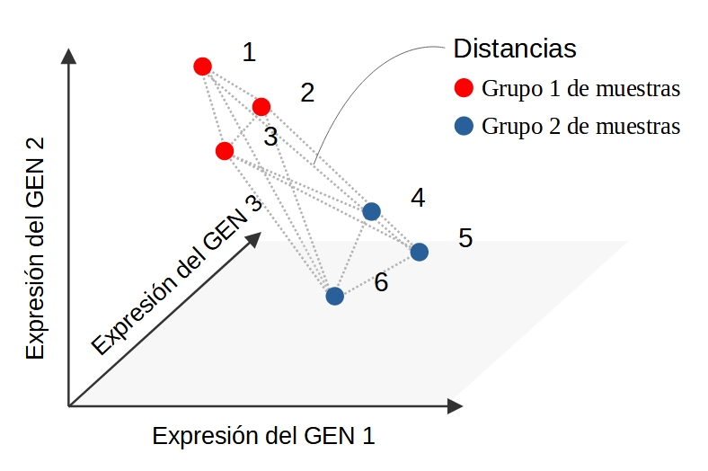
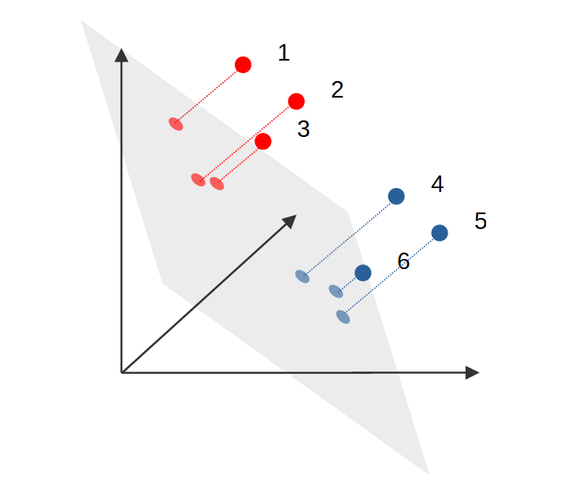
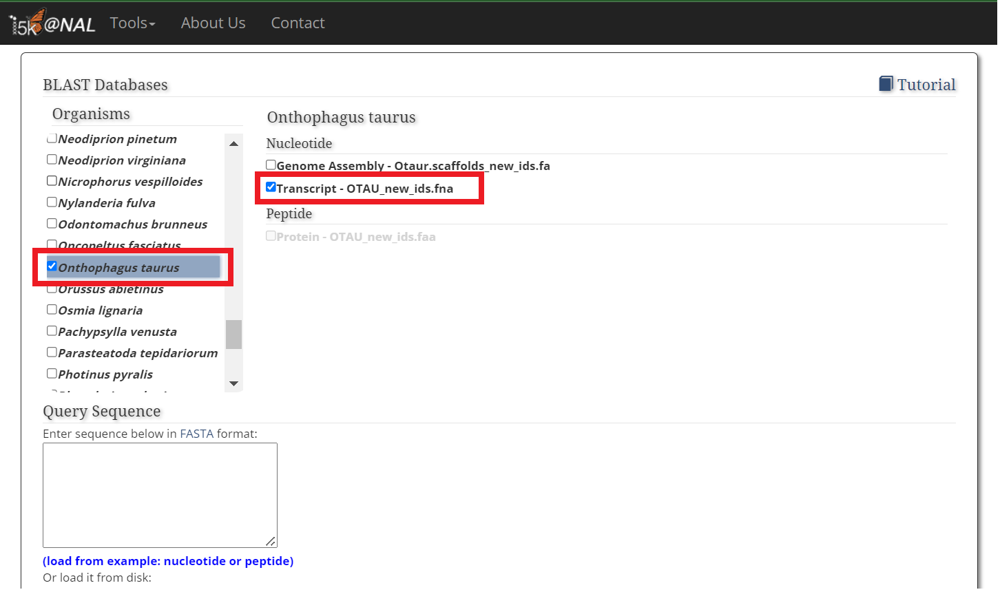

## Importación de *paquetes*

Si la instalación de todo funcionó, entonces podemos cargar los paquetes en la sesión de trabajo de R actual. A diferencia de la instalación, esta parte hay que correrla cada vez que abramos una nueva sesión en R.

```{r Carga de librerías, warning=FALSE, message=FALSE, results='hide'}

# Definimos la lista de nombres de los paquetes que R va a llamar

pckg.ls=c(# análiis de datos moleculares (bioconductor)
         "DESeq2", "vsn", "apeglm", "genefilter", "IHW", "edgeR", 
         
          # otros paquetes
         "dplyr", "tidyr", # manipulación de datos
         "ggplot2", # generación de gráficos
         "pheatmap", # gráficos de mapas de calor
         "RColorBrewer", # paletas de colores para los gráficos
         # "PoiClaClu", # cálculo de distancias de Poisson
         # "ggbeeswarm", 
         'gridExtra', # múltiplies gráficos en un único panel
         'colorspace' # configuraciones de color
         )

# E importamos los paquetes de esa lista

lapply(pckg.ls, # para cada nombre de la lista de paquetes instalados...
       require, # aplicar la función "require" para importarlo
       quietly =T,
       character.only = TRUE) # (ignorar este argumento, es para las mañas de R)

```


## Importación y preparación de los datos

### Tabla de conteos

La tabla de conteos tiene, en cada **celda**, el número de fragmentos de RNA secuenciados de cada *muestra* que fueron identificados como provenientes de cada *gen*. Por lo tanto, tiene tantas *columnas* como muestras hayamos utilizado como fuente de RNA, y tantas *filas* como genes para los cuales se registró el numero de fragmentos de RNA secuenciados.

```{r}
# importación
cts <- read.delim("./Conteos.tsv", row.names = "gene")

```
Podemos explorar las primeras filas y columnas para tener una imágen de cómo se organiza esta tabla.

```{r}
# filas de 1 a 6, columnas de 1 a 3
cts[1:6, 1:3]

```

Vemos que cada **fila** tiene el nombre asociado al gen correspondiente. `OTAU000001` no es el *nombre* de un gen propiamente dicho, sino que es el identificador que se le asignó a esa región codificante en el genoma que estamos utilizando.
Por otra parte, en cada **columna** vemos un nombre asociado a la muestra de donde se sacó el RNA para secuenciar. Estos nombres tienen la información sobre el *diseño experimental*, es decir, el tratamiento con RNA de interferencia sobre dsx (ctrl/trat), el sexo (M/F), y el tejido (BRN/CHE/GEN/THE). `ctrlRNAi_M.BRN_S19` es una muestra del cerebro (BRN = brain) de un macho (M = male) al que no se le aplicó interferencia de RNA dirigida a dsx (ctrl).


**1. ¿Qué función/es de R podríamos utilizar para conocer la cantidad de genes y de muestras en estos datos? ¿Cuántos genes hay? ¿Y muestras?**


### Tabla de diseño experimental

Si bien los nombres de las columnas de la tabla de conteos tienen la información sobre el diseño experimental (tratamiento, sexo y tejido), esta es una fuente un poco incómoda para comparar los patrones de expresión entre grupos de forma programática. Para realizar análisis de comparación entre grupos, utilizamos una segunda tabla que tiene toda la información sobre las muestras de forma más ordenada.

```{r, echo=F, eval=F, include=F, purl=F}
# generación del archivo con las filas ordenadas
# not run or shown in render
samples0 <- read.delim("./Muestras.tsv", sep="\t", row.names=1)
samples <- samples0[,c(5, 6, 4, 2, 13)]
samples=dplyr::rename(samples, lib.size=genome_unique)
```


```{r}

samples <- read.csv("./Muestras_reord.tsv", row.names=1)

```

Al igual que antes, podemos explorar visualmente la tabla mostrando solo algunas filas
```{r}
# filas de 1 a 8, todas las columnas
samples[1:8,]

```

**2. ¿A qué cree que hace referencia la útima columna?**

### Selección de muestras

Para seleccionar el conjunto de muestras a utilizar, vamos a generar un `vector lógico` (de `TRUE`/`FALSE`) de 96 elementos (uno por cada muestra). La idea es que este vector tenga valores `T` en las posiciones de las muestras que queremos conservar para el análisis y `F` para aquellas que queremos descartar.

```{r}

# nombres de las categorías a conservar (todas en este caso)
tejidos=c('CHE', 'THE', 'BRN', 'GEN')
sex=c('F', 'M')
trat=c('ctr', 'dsx')


# Índice T/F de muestras que pertenecen a las combinaciones de categorías especificadas
#   El operador & indica T sólo si se cumplen las condiciones a izquierda y derecha a la vez 
#   (T&T = T; T&F = F; F&F = F)
idx.muestras= samples$Tissue %in% tejidos & 
  # TRUE para las muestras pertenecientes (%in%) a los tejidos definidos
  
  samples$Sex %in% sex & 
  # TRUE para las muestras pertenecientes (%in%) a los sexos definidos
  
  samples$Treatment %in% trat 
  # TRUE para las muestras pertenecientes (%in%) a los tratamientos definidos

```

Corra la siguiente linea en la consola para ver cómo quedan asignados los valores `T`/`F` a cada muestra.

```{r, echo=T, results='hide'}

cbind(samples, idx.muestras) 

```

### Combinación en un único dataset

Para usar la mayoría de herramientas de análisis de este TP es necesario combinar estas dos tablas en un único *objeto*. Para esto, primero tenemos que chequear que cada columna de la tabla de conteos sea asociable inequívocamente a la fila correspondiente en la tabla de muestras.

```{r}
# para corregir diferencias en el orden de las columnas-filas entre tablas
cts=cts[,rownames(samples)] 

all(rownames(samples) == colnames(cts)) # debe devolver TRUE

```

Una vez que chequeamos esto podemos unir ambas tablas en un tipo de objeto utilizado por las herramientas de análisis de expresión diferencial (DE) incluidas en el paquete DESeq:

```{r, warning=F}
#objeto DESeqDataSet
data_0 <- DESeqDataSetFromMatrix(countData = cts[,idx.muestras],
                                 colData = samples[idx.muestras,
                                                   c("Sex", "Tissue", "Treatment")],
                                 design = ~  Sex + Tissue + Treatment) 
```

Podemos explorar la información general de este objeto si corremos su nombre en la consola.

```{r}
data_0
```

## Filtrado del dataset

Podemos descartar genes que tengan una cantidad de fragmentos secuenciados (reads) por debajo de un determinado umbral.

```{r}
# Probar con diferentes valores
reads.minimos=100

# genes sobre el umbral (suficientes reads)
c(rowSums(counts(data_0)) >= reads.minimos ) %>% sum()

```

Para el resto del trabajo vamos a utilizar un umbral de 10 lecturas para considerar genes con suficiente información, pero sin descartar demasiados.
```{r}
reads.minimos=10

data_filtered <- data_0[rowSums(counts(data_0)) >= reads.minimos,]

# Cantidad de genes finales
n.genes=nrow(data_filtered)

```

## Comparación de transcriptomas entre muestras

A continuación, vamos a realizar una comparación general de los transcriptomas de todas las muestras. Recuerde que cada muestra cuenta, para cada gen, con un nivel de expresión determinado (el cual aproximamos con el número de lecturas de RNAseq que mapearon sobre ese gen). Por lo tanto, podemos considerar que cada muestra está en una determinada posición en cada uno de los `r n.genes` ejes definidos por el conjunto de genes.



### Estabilización de la varianza (marco teórico **opcional**)

Más allá de las diferencias de expresión de cada gen *entre muestras*, es esperable que los niveles basales de expresión de cada gen sean diferentes entre sí. Es decir, que haya genes que tengan, en todas las muestras, mayores niveles de expresión que otros genes. Un problema de esto es que genes con mayor expresión tienen a su vez mayor *varianza* entre muestras. Imaginemos que tenemos un gen **A** con un nivel de expresión de 100 y un gen **B** con un nivel de 10.000. En este caso, variaciones en el nivel de expresión (entre muestras) del 10 % generarían diferencias de +/- 10 para el gen A y +/- 1000 para el gen B. Por lo tanto, a la hora de calcular *distancias* entre muestras (ver figura anterior), estas estarían gobernadas por los genes con mayores niveles de expresión, despreciando la información contenida en las diferencias de expresión de genes con niveles basales muy bajos.
Para sortear este problema, y poder comparar muestras en función de todo su transcriptoma de forma representativa, se suelen realizar transformaciones de los datos que *estabilicen* la varianza. Esto significa que los valores de conteos ya no son los reales, pero conservan la información de las diferencias entre muestras como para hacer las comparaciones de transcriptomas completos. En este caso vamos a utilizar la transformación propuesta por Anders y Huber (2010,  *https://doi.org/10.1186/gb-2010-11-10-r106*) implementada en la función `vst`.

```{r}
data_var.st=vst(data_filtered, blind = FALSE)
```

**Nota:** *como los conteos de cada gen han sido modificados, este dataset transformado no puede ser utilizado para comparar la expresión de cada gen particular entre muestras. Sólo lo vamos a utilizar para comparar entre transcriptomas completos.*

#### Análisis de Componentes Principales (PCA)

A continuación, vamos a visualizar la configuración de las muestras en el *espacio* de variables definido por los niveles de expresión de cada gen. Como este espacio tiene demasiadas dimensiones (`r n.genes`) vamos a realizar una reducción dimensional mediante la proyección de la "sombra" de cada punto (correspondiente al transcriptoma de una muestra) sobre un plano de 2 dimensiones (Componentes Principales).



Primero usamos la función `plotPCA` para generar el nuevo plano 2D sobre el que proyectar los puntos, y guardamos los datos de las nuevas coordenadas en el objeto `pcaData`.

```{r}

# cálculo de las nuevas dimensiones (proyección sobre dos componentes principales)
pcaData <- plotPCA(data_var.st, 
                   intgroup = c("Tissue", "Sex", "Treatment"), 
                   returnData = TRUE)
percentVar <- round(100 * attr(pcaData, "percentVar"))

pcaData$tt=paste0(pcaData$Tissue, '-', pcaData$Treatment)

```

Ahora generamos un gráfico de puntos donde se vean las posiciones de cada muestra en este nuevo sistema de coordenadas. 
Primero hay que dar un poco de vueltas para configurar los colores de los puntos para cada grupo de muestras. Esto es medio enroscado así que puede saltar al siguiente bloque de código.

```{r}
# Configuración de los colores de los puntos 
colores=c(BRN='dodgerblue', 
               CHE='limegreen', 
               GEN='darkgoldenrod2', 
               THE='coral1')[tejidos]

colores.trat=colorspace::lighten(colores, 0.5)
names(colores.trat)=paste0(tejidos, '-dsx')

colores.ctrl=colorspace::darken(colores.trat, 0.4)
names(colores.ctrl)=paste0(tejidos, '-ctr')

colores2=c(colores.trat, colores.ctrl)
```

Una vez configurados los colores, podemos hacer el gráfico de PCA. Para esto vamos a utilizar el paquete `ggplot2`, que contiene una gran cantidad de funciones que nos permiten controlar de forma precisa los distintos aspectos de un gráfico. La comprensión de la sintaxis de `ggplot` va más allá del alcance de este TP pero, de forma **opcional**, puede tratar de comprender cómo se relacionan las diferentes partes en el siguiente código. Nótese que no hay una única función que contenga todo el código dentro de sus paréntesis, sino que los objetos y/o configuraciones se van agregando con diferentes funciones de forma secuencial mediante el operador `+`.

```{r, fig.height=5, fig.width=6, fig.align='center', results='hide', fig.show='hide'}

# Generación inicial del gráfico
ggplot(pcaData, # datos de entrada
       
     # aspectos del gráfico que dependen de variables presentes en los datos
       aes(x = PC1, # posición en X
           y = PC2, # posición en Y
           fill = tt)) + # color de relleno
  
  # Recién acá le indicamos que queremos dibujar puntos sobre el gráfico.
  geom_point(size =2.5, shape=23) + 
  # Sus coordenadas y colores van a ser definidos por el mapeo especificado en aes().
  # Tamaño y forma son especificados fuera de aes() ya que, en este caso, 
  #     no dependen de variables de los datos
  
  # Especificación del conjunto de colores y su leyenda
  scale_fill_manual(values = colores2, 
                    name=' ctr    dsx', 
                    labels=c(rep('', length(tejidos)), tejidos))+
  
  guides(fill=guide_legend(ncol=2)) +
  
  # titulos de ejes
  xlab(paste0("PC1: ", percentVar[1], "%")) +
  ylab(paste0("PC2: ", percentVar[2], "%")) +
  
  facet_grid(Sex ~ .)+ # ¿?
  
  theme_bw() # estética

```

**3. Opcional: ¿Qué cree que hace la función `facet_grid()`? ¿Qué cree que pasaría si en vez de `Sex ~ .` el argumento fuera `. ~ Sex`?**

**4. ¿Qué patrón de similitud/diferencia entre grupos de muestras observa?**

#### Heatmap 

A continuación vamos a utilizar otra técnica de visualización para comparar muestras en cuanto a sus transcriptomas: los mapas de calor (o *Heatmaps*). Estos son básicamente representaciones gráficas de *matrices de distancias*. Una matriz de distancias es una tabla en la que cada elemento $d_{ij}$ corresponde a la distancia entre la observación i y la observación j. En este caso, utilizamos la acepción más literal de distancia (distancia "en linea recta"), por lo que $d_{ij} = d_{ji}$; es decir, la matriz es simétrica sobre su diagonal.
Para generar nuestro mapa de calor, primero vamos a calcular la matriz de distancias con la función `dist`.

```{r}
# cálculo de distancias
sampleDists <- dist(t(assay(data_var.st)))

# transformación del tipo de objeto R (class: dist -> matrix)
sampleDistMatrix <- as.matrix( sampleDists )

# homologar nombres de filas y columnas
rownames(sampleDistMatrix) <- rownames(samples)[idx.muestras]
colnames(sampleDistMatrix) <- rownames(samples)[idx.muestras]

sampleDistMatrix[1:4, 1:4] # ver primeras 4 filas y 4 columnas
```
**5. ¿Qué dimensiones espera que tenga esta matriz de distancias?**

**6. ¿Cómo se explican los valores de la diagonal?**

Ahora, con esta matriz de distancias vamos a generar un mapa de calor con la función `pheatmap` para poder interpretarla más facilmente de forma visual.

```{r, fig.height=6.8, fig.width=8, fig.align='center', results='hide', fig.show='hide'}
# çonfiguración de la paleta de colores
heatmap.1.colors <- colorRampPalette( brewer.pal(9, "YlOrRd")[6:1] )(255)

pheatmap(sampleDistMatrix,
         col = heatmap.1.colors, border_color = NA, 
         
         fontsize_row = 4.5, fontsize = 11, # tamaño de las letras
         
         cluster_cols = F, cluster_rows = F, # mantener el orden de filas y columnas
         
         # información para el código de anotación por colores de columnas
         annotation_col  = samples[idx.muestras,1:3], 
         
         # información para el código de anotación por colores de filas 
         annotation_row  = samples[idx.muestras,1:3], 
         
         show_colnames=F, show_rownames=T, # nombres de muestras en filas
         
         annotation_names_row=F, legend = F, # mostrar qué significa cada color
         
         # configuración de los colores de cada grupo de muestras
         annotation_colors = list(Sex=c(M='slateblue2', 
                                        F='hotpink1')[sex], 
                                  
                                  Treatment=c(ctr='gray90', 
                                              dsx='gray10')[trat], 
                                  
                                  Tissue=c(BRN='dodgerblue', 
                                           CHE='limegreen', 
                                           GEN='darkgoldenrod2', 
                                           THE='coral1')[tejidos]
                                  )
         )

```

**7. ¿Son coherentes los patrones de similitud y diferencia entre las muestras observados en el PCA y el Heatmap?**

**8. ¿Qué patrón prominente observa? ¿Hay algún factor (tejido, sexo, tratamiento) que determine más el perfil transcriptómico de una muestra que los otros factores?**


## Análisis de expresión génica diferencial

### Análisis estadístico utilizando `DESeq`

A continuación vamos a realizar un análisis estadístico de expresión diferencial. Este evalúa el grado de diferencia en el nivel de expresión de cada gen entre los diferentes niveles de cada factor especificado (tejido, sexo, tratamiento, etc.). Para este análisis, vamos a trabajar sólo con las muestras del *tejido cefálico* sin tratamiento con RNA de interferencia de *dsx*. El filtrado lo hacemos utilizando un vector lógico (`idx.muestras`) igual que antes.

```{r, warning=F}

# nombres de las categorías a conservar
tejidos=c('CHE') # tejido cefálico
sex=c('F', 'M') # ambos sexos
trat=c('ctr') # individuos control

# índice T/F de muestras que pertenecen a las combinaciones de categorías especificadas
# el operador & indica T sólo si se cumplen las condiciones a izquierda y derecha a la vez 
# (T&T = T; T&F = F; F&F = F)
idx.muestras= samples$Tissue %in% tejidos &
  samples$Sex %in% sex &
  samples$Treatment %in% trat

# objeto DESeqDataSet (conteos + información de muestras)
data.DE_0 <- DESeqDataSetFromMatrix(countData = cts[,idx.muestras],
                                       colData = samples[idx.muestras, 
                                                         c("Sex", "Tissue", "Treatment")],
                                       design = ~  Sex)


reads.minimos=10

data_DE <- data.DE_0[rowSums(counts(data.DE_0)) >= reads.minimos,]

# Cantidad de genes incluidos en el análisis
nrow(data_DE)

```
Con estos datos filtrados utilizamos la función `DESeq` para estimar el nivel de expresión de cada gen a lo largo de las diferentes condiciones (puede tardar varios segundos en correr).

```{r, results='hide', message=F}
de.an=DESeq(data_DE)
```
Con el resultado de esta estimación, podemos generar una tabla que muestre el grado de expresción diferencial para cada gen entre diferentes condiciones. Por defecto, la función `results` utiliza la fómula definida al crear el objeto `DESeqDataSet` para hacer las comparaciones, pero nosotros podemos especificar la comparación que deseemos mediante el argumento `contrast`.

```{r}
res = results(de.an, contrast = c('Sex', 'M', 'F')) %>% 
  as.data.frame() %>% 
  dplyr::select(-c(4:5)) # borrar algunas columans que no son de interés

head(res, 5)

```

Para cuantificar la magnitud del cambio en el nivel de expresión entre condiciones (Macho y Hembra en este caso, como se especifica en `contrast`) se suele utilizar el estadístico del *Log2FoldChange* (LFC). El valor del LFC representa cuántas veces se duplicó (o se redujo a la mitad) el conteo de reads mapeados a cada gen (nuestro estimador del nivel de expresión). Éste se calcula como 
$$
LFC = log_2 \left( \frac{E_M}{E_F} \right)
$$
Donde $E_M$ es el nivel de expresión en Machos y $E_F$ es el nivel de expresión en Hembras. De esta fórmula puede deducirse que, en este caso, el LFC toma valores positivos cuando $E_M > E_F$ y negativos cuando $E_M < E_F$. La relación está especificado en este sentido por el orden de `M` y `F` en el argumento `contrast` utilizado al generar la tabla de resutlados; si se invirtiera este orden entonces se invertiría el cociente de la ecuación anterior y, por lo tanto, el signo de los LFC. Además del signo, el valor específico del LFC nos dá información sobre la cantidad de cambio, correspondiendo cada unidad a un factor 2. Es decir, un $LFC=1$ significa que la expresión es el *doble* en machos que en hembras; un $LFC=-3$ indica que la expresión es *8 veces mayor* en hembras que en machos.

Para identificar los genes con mayor diferencias en su expresión vamos a reordenar por |LFC| y filtrar por significancia estadística de estas diferencias.


```{r, results='hide'}

res2=res[order(abs(res$log2FoldChange), decreasing = T),] %>% # re-ordenamiento
  as.data.frame() %>% # llevar a formato (class) data.frame
  filter(padj<=0.05) # filtrar por significancia (p-valor < 0.05)

# print primeras filas
print(head(res2))

```
Exportamos estas filas a un archivo que gusrdamos en el almacenamiento.

```{r}

write.table(res2%>% # tabla completa
              mutate(gene=rownames(res2)) %>% # agregamos columna de genes
              mutate(genomic.sequence=NA) %>% # columna vacía para llenar después
              head(), 
            file = './head.results_samples.CHE.ctrl_DE.MvsF.csv', 
            sep = '\t', row.names = F)

```


### Comparación gráfica utilizando `ggplot`

También podemos hacer una comparación gráfica de los niveles de expresión de cada gen entre condiciones. Para esto, lo más correcto sería corregir/normalizar los valores de conteos por *tamaño de la librería*. Esto se debe a que durante la extrracción y preparación del RNA para la secuenciación, hay errores de procedimiento que generan variaciones en la cantidad de RNA entre muestras que nada tienen que ver con diferencias en el nivel de expresión. Por lo tanto, conviene relativizar el conteo de cada gen de una muestra respecto de la cantidad total de reads que se obtuvieron de la misma.
Las siguientes lineas hacen esa normalización.

```{r}

# se pasa a clase "matrix" y se transpone la tabla (se acuesta) para normalizar por columnas
cts.trans=cts %>% 
  as.matrix() %>% 
  t() 

# vector de tamaños de librerías (en unidades de 10 millones)
norm.vec=(samples$lib.size/1e7)

# normalización por columnas (dividir la matriz por el vector)
# Nota: en R esto es al reves que en las operaciones matriciales de algebra, 
#       donde los vectores se aplican sobre las filas
cts.trans.norm=cts.trans/norm.vec

# vuelvo a parar la tabla y trandofrmarla en data.frame
cts.norm=t(cts.trans.norm) %>% 
  as.data.frame()

```

```{r}
topgenes.n=5 # cantidad de genes a considerar
```


Ahora, con esta tabla de conteos normalizados podemos graficar los niveles de expresion de los `r topgenes.n` genes con mayores diferencias entre sexos. Para ello primero reorganizamos un poco las tablas.

```{r}

genes=rownames(res2)[1:topgenes.n] # nombres de estos genes

genes.exp=cts.norm[genes,] %>% # extracción de estos genes de la tabla de conteos
  t() # verticalización para poder juntar con la tabla del diseño experimental

exp.table=cbind(samples, genes.exp) # unión con la tabla de diseño

exp.table.long=pivot_longer(exp.table, cols = -c(1:5), 
             names_to = 'gene', values_to = 'exp') # verticalización


```

Y filtramos sólo aquellos datos que nos interesa graficar. Por ahora sólo queresmo comparar la expresión de los dos genes de interés entre los tejidos cefálicos de machos y hembras control.

```{r}
data.plot= as.data.frame(exp.table.long) %>% # cambiamos a CLASS data.frame
         filter(Treatment %in% trat) %>% # filtramos por tratamiento (sólo ctr)
         filter(Tissue %in% tejidos) # filtramos por tejido (sólo CHR)) 

```

Ahora le pasamos esta tabla a `ggplot`, una función del paquete `ggplot2` que permite generar gráficos controlando de forma precisa, y relativamente simple, muchos parámetros gráficos. Notesé que la generación del gráfico comienza con el llamado de la función `ggplot(data.plot)`, seguida de múltiples funciones que se van sumando con `+` para agregar elementos o configuraciones al gráfico.

```{r, fig.height=5, fig.width=3, fig.align='center', fig.show='hide'}

# datos en los que ggplot buscará lo que le ordenemos en la progrmación del gráfico
ggplot(data= data.plot) +  
  
  # generamos un elemento (geom) de puntos
  # la posición de cada punto codificará el nivel de expresión en función del sexo
  geom_jitter(aes(x=Sex, y=exp, 
                  
                  # el relleno de los puntos también codificará el sexo
                  fill=Sex), 
              
               # ancho de la dispersión horizontal aleatoria (para que no se solapen tanto)
               width = 0.05, 
               height = 0, # sin dispersión vertical de los puntos
               pch=21, # estilo de punto
               size=3, # tamaño de los puntos
               alpha=0.5)+ # transparencia (0 - 1)
  
  scale_fill_manual(values = c(M='slateblue2', F='hotpink1'))+ # colores de cada sexo
  
  facet_grid(gene~., # desdoblamos el gráfico verticalmente, uno para cada gen
             labeller = labeller(gene = paste0(
               # título de cada panel
             genes, '
LFC = ', res$log2FoldChange[rownames(res) %in% genes] %>% round(2)) %>% 
               `names<-`(genes))
               ,
             scales = 'free')+ # cada panel puede tener su propia escala
  
  labs(x=NULL, y='Expresión')+ # títulos de ejes
  
  theme_bw() # estética general del gráfico


```

**9. ¿Son estos gráficos coherentes con los signos de los valores de LFC? Justifique**

### Investigación sobre genes diferencialmente expresados

Busque los **dos** genes con mayor diferencias en su expresión (entre las regiones de los cuernos cefálicos de machos y hembras) en el *Apollo Browser* del consorcio i5k (https://i5k.nal.usda.gov/node/739225). Para cada uno, copie el código (`OTAU0...`) de la tabla `res2` (recordemos que esta contiene lo mismo que `res` pero está ordenada por LFC y filtrada por significancia estadística). Para buscar el modelo correspondiente, pegue el código en el buscador del browser Apollo y complete con `-RA` al final. Esto es necesario ya que la base de datos de Apollo almacena los modelos de genes de *O. taurus* con el sufijo `-RA`.
En el panel de la izquierda, active los tracks de *coverage* de RNA proveniente de machos (`O. taurus M PD1 BRN+CHE+THE+GEN transcripts`) y  de hembras (`O. taurus F PD1 BRN+CHE+THE+GEN transcripts`). Si bien estos están construidos a partir de lecturas de RNAseq proveniente de todos los tejidos, no solo tejido cefálico (`CHE`), pueden darnos información sobre expresión diferencial entre sexos a nivel general. 

**10. ¿Son las diferencias de covergae entre machos y hembras coherentes con los valores de LFC y el gráfico de expresión? Justifique**

Elija uno de estos genes para . 

Seleccione el modelo clickeando en un intrón, luego *click derecho* -> *View details*. Scrollee hasta la primer secuencia, selecciónela con doble click y cópiela en un archivo de texto (puede usar la última columna, vacía, del archivo de texto .csv generado previamente). Esta corresponde a la secuencia **genómica** del modelo, por lo tanto, contiene tanto CDS como UTRs e intrones.

**11. ¿Qué tipos de BLAST podría utilizar para identificar esta secuencia con de la base de datos de NCBI? ¿Cuáles creen que pueden ser los pros y contras de cada uno de ellos?**

Realice un BLAST de cada uno de los tipos de algoritmos que sugirió, utilizando la secuencia copiada como query, desde el sitio de *BLAST de NCBI* (`https://blast.ncbi.nlm.nih.gov/Blast.cgi`).

**12. Teniendo en cuenta los primeros hits resultantes**
**¿De qué gen se trata, o a qué familias génicas se asemeja?**

### Búsqueda de gen/es específico/s

Uno de los tantos genes que se cree puede estar relacionado con la regulación del desarrollo de cuernos (ver *Linz & Moczek, 2020*) es *cubitus interruptus* (*ci*). Para evaluar si este se encuentra diferencialmente expresado entre los tejidos cefácilos de machos y hembras de *O. taurus*, es necesario averiguar el código del modelo de gen correspondiente. Con el código del modelo de gen vamos a poder identificar la fila correspondiente en la tabla de resultados del anális de expresión diferencial (`res`) e interpretar los valores de LFC y p-valores.

Para encontrar el modelo de gen de *O. taurus* correspondiente a *ci*, podemos buscar aquel cuya secuencia se asemeje más a la secuencia del mismo gen en una especie cercanamente emparentada. Para esto podemos utilizar la secuencia de *ci* del escarabajo modelo *Tribolium castaneum* como query en un BLAST que busque esta secuencia entre las de los modelos de *O. taurus*.
Para obtener la secuencia de *ci* de *T. castaneum*, busque `cubitus interruptus tribolium castaneum` en las bases de datos de `Gene` de NCBI. El primer resultado debería ser el que necesitamos. Dentro de este, vaya a la sección de `NCBI Reference Sequences (RefSeq)` y busque la versión proteica de la secuencia (es aquella con el prefijo XP_). Al abrir el enlace de esta proteína aparece una opción, debajo del nombre de la misma, para obtener la secuencia en formato FASTA. Esta es la secuencia que vamos a utilizar como query para identificar el modelo de gen de *ci* en *O. taurus*.

**13. Considerando que los posibles *targets* de la búsqueda BLAST son las secuencias nucleotídicas de los modelos de genes de *O. taurus* ¿Qué tipo de BLAST cree que se debería utilizar en este caso?**

Vaya a la plataforma de BLAST del consorcio i5k (en el que se encuentran enmarcados el genoma y los modelos de *O. taurus* que estamos utilizando): https://i5k.nal.usda.gov/webapp/blast/. Seleccione la especie *Onthophagus taurus* y, en particular, el set de datos de Transcripts (que contiene las secuencias de cada modelo de gen).



En la caja del query pegue la secuencia de *ci* de *T. castaneum* y clickee en `search` para ejecutar el BLAST. Notese que en este caso la plataforma identificó automáticamente el tipo de BLAST a ejecutar, pero a veces puede ser necesario especificarlo.
En la tabla de resultados (panel de abajo a la izquierda), identifique el modelo de gen que obtuvo un mejor hit.

**14. ¿Qué E-value tiene? ¿Considera que es un hit con un buen soporte estadístico?**

Si es así, copie el código de ese modelo de gen (sin el sufijo `-RA`) y utilícelo para buscar si mostró expresión diferencial entre los tejidos cefácilos de machos y hembras de *O. taurus*. Para esto, puede fitrar la tabla de resultados del análisis de expresión diferencial (`res`) con la siguiente linea (reemplace el string `codigo` por el código del modelo).

```{r eval=F}
res[rownames(res)=='codigo',]
```


**15. ¿Está el gen *ci* diferencialmente expresado entre los tejidos cefálicos de machos y hembras? ¿En qué sexo se expresa más? ¿Cuántas veces mayor es el nivel medio de expresión en ese sexo?**


```{r para diapositiva, echo=F, include=F, fig.width=8, fig.height=3, purl=FALSE}

# este codigo es para una diapo, IGNORAR

topgenes.n=10 # cantidad de genes a considerar

genes.2=rownames(res)[c(2, 3, 7:9)] # nombres de estos genes

genes.2=c(genes.2, rownames(res2)[1:2])

genes.exp.2=cts.norm[genes.2,] %>% # extracción de estos genes de la tabla de conteos
  t() # verticalización para poder juntar con la tabla del diseño experimental

exp.table.2=cbind(samples, genes.exp.2) # unión con la tabla de diseño

exp.table.long.2=pivot_longer(exp.table.2, cols = -c(1:5), 
             names_to = 'gene', values_to = 'exp')

exp.table.long.2$Treatment[exp.table.long.2$Treatment=='dsx']='trat'


data.plot.2 = as.data.frame(exp.table.long.2) %>% # cambiamo a CLASS data.frame para trabajar con filter()
         # filter(Treatment %in% trat) %>% # filtramos por tratamiento (sólo ctr)
         filter(Tissue %in% tejidos) %>%  # filtramos por tejido (sólo CHR)) 
  filter(Sex=='F')

ggplot(data= data.plot.2) +  # datos en los que ggplot buscará lo que le ordenemos en la progrmación del gráfico
  
  # generamos un elemento (geom) de puntos
  geom_jitter(aes(x=Treatment, y=exp, # la posición de cada punto codificará el nivel de expresión en función del sexo
                  fill=Treatment), # el relleno de los puntos también codificará el sexo
              width = 0.2, # ancho de la dispersión horizontal aleatoria (para que no se solapen tanto)
             pch=21, # estilo de punto
             size=3, # tamaño de los puntos
             alpha=0.5)+ # transparencia (0 - 1)
  
  scale_fill_manual(values = c(ctr='grey95', trat='black'))+ # colores de cada sexo
  
  facet_grid(.~gene, # desdoblamos el gráfico verticalmente, uno para cada gen
             scales = 'free')+ # cada panel puede tener su propia escala
  
  labs(x=NULL, y='Expresión')+ # títulos de ejes
  
  theme_bw() # estética general del gráfico


```


